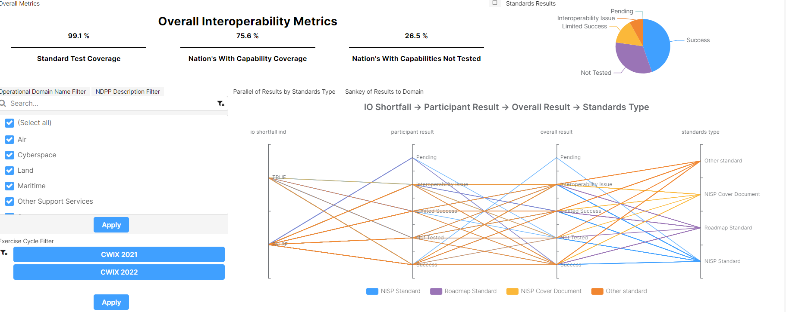

# Interoperability Metrics Insight

An insight is an analytics dashboard created using an open source web app tool called SEMOSS (Semantic Open Source Software). The purpose of this insight is to provide an overview of the current interoperability state based on testcase results from event cycles. 

At the top of the insight is a static KPI displaying three metrics to report the overall interoperability of the test events: *Standards Test Coverage*, *Nations with Capability Coverage*, *Nations with Capabilities Not Tested*. 

- *Standards Test Coverage*: The percent of standards that have gone through a testcase. This is calculated by uniquely counting the number of standards associated with a testcase, dividing that by the total standards being tracked, and multiplying that by 100. The purpose of this metric is to track the test coverage of the standards to help inform on the coverage for the nest test event in order to prevent interoperability gaps that may occur if a standard is not tested.
- *Nations with Capability Coverage*: The percent of nations with capabilities. This is calcualted by uniquely counting the number of nations tied to a capability, dividing that by the total unique count of nations, and multiplying by 100. The purpose of this metric is to report the coverage of nations being tracked and if an inquery needs to go to the nations without capabilities to ensure proper interoperabiilty coverage.
- *Nations with Capabilities Not Tested*: The percent of nations with capbilities that have not been tested. This is calcualted by uniquely counting the number of nations tied to a capability that is not represented in the test participants table divided by the unique count of nations. Capabilities not tracked in there are assumed to have not been tested. If these are fielded or near fielded capabilities, this could be a risk and they should be incorporated in the text event cycle. 

The rest of the insight is made up of dynamic KPIs that the user can filter on to show more specific information. The user has the ability to filter on Event Cycle, Operational Domains, and NDP Codes. The filters are located in the bottom left. Toggle through the tabs on top of the filters to switch between Operational Domains and NDP Codes. The dynamic charts:

- *Standards Results*: Pie in the upper right. Each wedge represts the percent of standards assicated with each overall result from a testcase. Overall results options: Success, Pending, Limited Success, Not Tested, or Interoperability Issue. 
- *Parallel of Results to Standard Type*: The Parallel Coordinates Chart maps the IO Shortfall to the Participant Results to the Overall Results to the Standard Type. Using the filters, the user can determine with event cycle, domain, or NDP that have shortfalls, the impact to the participant results, and if it affected the overall result, and which type of standards they are. This can start to give the user an insight into the overall impact. 
- *Sankey of Results to Domain*: The Sankey chart is tabbed behind the Parallel Coordinates. Click on the tabs to switch between. See below for what the insight looks like when the Sankey is chosen. The Sankey chart maps the IO Shortfall to the Overall Results to the Operational Domain. The thickness of the lines represents the unique count of standards that are mapped between the elements. For example, if you look at the picture below, when the mouse hovers on the uppermost bar between Overall Results and Operational Domain there were 1553 standards associated with that connection in the database. As with the Parallel Coordinates, using the filters can allow the user to investigate the number of standards in assocaiton with these elements to get a better understanding of the results from the testcases and how the operational domains or NDP may affected by shortfalls.

