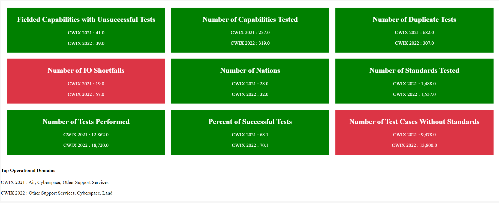

# Overall Evaluation

An insight is an analytics dashboard created using an open source web app tool called SEMOSS (Semantic Open Source Software). The purpose of this insight is to provide overall metrics between event cycles for users to compare and see if there have been improvements or not.

In this insight, users will see a grid of metrics. Within in box, metrics observed each year are compared side by side. Boxes with green have shown improvement from one year to the next and red boxes show lack of improvement. Each time a user hovers over a box, the box will flip to display how these metrics were calculated. At the bottom of the insight the top Operational Domains are listed so users can observe where the test cases were focused.

The following metrics are captured in the insight:

- *Number of Tests in Each Event Cycle*: The unique count of test cases performed during each test cycle. The more capabilities that are fielded and the more standards that are needed for interoperabiity as technology progresses, this number is expected to go up from event cycle to event cycle to maintain full coverage of interoperability testing.
- *Number of Interoperability (IO) Issues Each Event Cycle*: The unique count of IO Issue flags that were observed during each event cycle. As standards are tested, this number is expected to go down each event cycle as issues were addressed after being flagged. 
- *Percent of Overall Success*: The percent of Successfully conducted test cases that were observed overall for each test case. The overall success rate would increase as NATO works to improve the standards and methods of capturing/testing interoperability.
- *Number of Nations*: The unique count of Nations that participated in each event cycle. As Nations join NATO, it would be expected for them to participate in event cycles. As a result, this number should gradually increase over time.
- *Number of Capabilities Tested*: The unique count of capabilities that were tested in each event cycle. The more capabilities that are fielded and the more nations that join NATO, this number is expected to go up from event cycle to event cycle to maintain full coverage of interoperability testing.
- *Number of Standards That Were Tested*: The unique count of standards that were tested in each event cycle. As technology progresses and becomes more advanced it is expected that more standards will be required for interoperability between capabilities. As a result, it is expected for this number to increase each year.
- *Number Test Cases That Were Duplicated*: The unique count of test cases that were duplicated in each event cycle. As test case reporting becomes more efficiet, it is expected for this number to decrease over time. 
- *Number of Test Cases That Were Not Associated With a Standard*: The unique count of test cases that were not associated with a standard in each event cycle. With test cases being aligned to standards it is expected for them to be associated wtih standards. As NATO strives to improve test case tracking and reporting is is expected for this number to decrease over time. An increase could potentially lead to interperability issues escatlating as they are not tracked correctly.
- *Number of Fielded Capabilities with Failed Test Cases*: The unique count of fielded capabilities that the participant failed in a test case. As test events are conducted and issues identified, it is expected for this value to decrease over time.